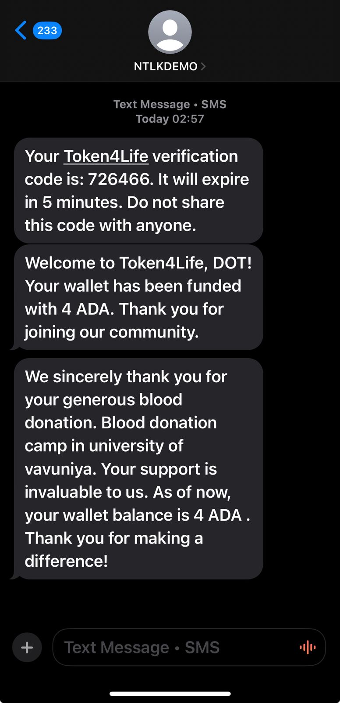
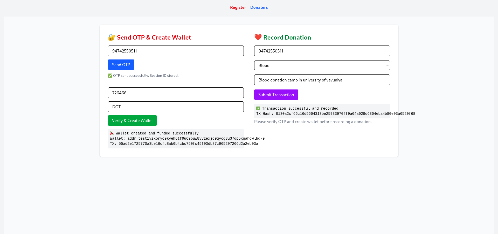
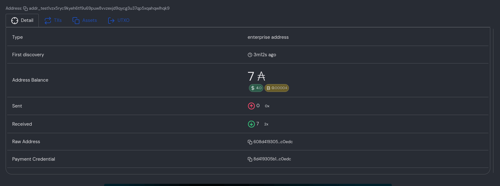

# 🚑 Token4Life – Donor Loyalty System on Cardano

Token4Life is a blockchain-based blood and organ donor loyalty platform built on the Cardano blockchain using Lucid, Node.js, and React. It aims to improve donor engagement, transparency, and trust using UTXO tracking, wallet-based identities, and SMS integration.

---

## 👨‍💻 Built By

Team DOT  
🧑‍🎓 University of Vavuniya  
🔗 Submission for Cardano Challenge 2025

---

## 🌟 Features

- ✅ Wallet-linked Donor Accounts
- ✅ Donor Registration + SMS Gateway Integration
- ✅ UTXO Tracking of Blood & Organ Donations
- ✅ Loyalty Points / ADA-based Contribution Metrics
- ✅ Admin Dashboard to View Donors & Transactions
- ✅ Secure & Transparent Data Storage

---

## 🧰 Tech Stack

| Layer       | Tech Used                              |
|-------------|----------------------------------------|
| Blockchain  | Cardano + Lucid                        |
| Backend     | Node.js + Express + Prisma             |
| Frontend    | React + Tailwind CSS                   |
| DB          | SQLite / PostgreSQL (via Prisma)       |
| Wallet      | Cardano Wallet (via CIP-30 / Lucid)    |
| Comms       | SMS Gateway (e.g. Twilio, Notify.lk)   |

---

## 📁 Project Structure

```
Token4Life/
├── backend/           # Node.js + Express + Prisma API
│   ├── index.js       # API entry point
│   ├── prisma/        # Prisma schema + migrations
│   ├── token/         # Lucid-based token logic
│   ├── testwallet.js  # Lucid wallet utility
│   └── checkAdmin.js  # Optional admin tools
│
└── frontendt4l/       # React Vite frontend
    ├── src/
    │   ├── pages/         # Home, DonorDashboard, etc.
    │   └── api.js         # Axios setup
    ├── public/
    └── vite.config.js
```

---

## 🚀 How It Works

1. **Donor Registration**
   - A user signs up with a valid Sri Lankan phone number.
   - Wallet address is linked via Lucid (Cardano).
   - SMS is used to confirm registration.
2. **Making Donations**
   - Blood or organ donations are recorded as blockchain transactions.
   - UTXOs (Unspent Transaction Outputs) are tracked via Lucid.
   - Amounts are converted into ADA-equivalents for loyalty.
3. **Viewing Dashboard**
   - Donors can view their wallet balance, transaction history, and reputation.
   - Admins can view all registered donors.

---

## 🧪 Setup Instructions

### 1️⃣ Clone the repo

```bash
git clone https://github.com/CoinCeylon/Token4life.git
cd token4life
```

### 2️⃣ Setup Backend

```bash
cd backend
# Install dependencies
npm install
# Configure your DB in .env (example using SQLite or PostgreSQL)
# npx prisma init
# Run migrations
npx prisma migrate dev --name init
# Start backend server
node index.js
```

### 3️⃣ Setup Frontend

```bash
cd ../frontendt4l
# Install dependencies
npm install
# Start frontend on Vite
npm run dev
```

Open in browser: [http://localhost:5173](http://localhost:5173)

---

### ⚙️ Environment Variables

You may need the following `.env` settings for the backend:

```
```env
DATABASE_URL="file:./dev.db"     
PORT=5000
SMS_API_KEY=your_sms_gateway_key

BLOCKFROST_API_KEY=your_blockfrost_api_key
NOTIFYLK_USER_ID=your_notifylk_user_id
NOTIFYLK_API_KEY=your_notifylk_api_key
NOTIFYLK_SENDER_ID=your_notifylk_sender_id

CARDANO_NODE_NETWORK_ID=2
AUTO_SUBMIT=true
SYSTEM_KEYHASH=your_system_keyhash
SYSTEM_MNEMONIC="your_system_mnemonic"
ADMIN_MNEMONIC="your_admin_mnemonic"
SYSTEM_WALLET_ADDRESS="your_system_wallet_address"
CARDANO_NETWORK=Preview
SYSTEM_PRIVATE_KEY="your_system_private_key"
```
> **Note:** Replace all `your_*` values with your actual credentials. Never commit real secrets or private keys to version control.

---

## 📸 Screenshots

### SMS part



### Wallet Integration



### Donor Dashboard




---


## 📄 License

This project is licensed under the Apache License 2.0. See the [LICENSE](./LICENSE) file for details.

## 🤝 Contributing

1. Fork this repo
2. Create your branch (`git checkout -b feature-name`)
3. Commit your changes
4. Push to the branch
5. Create a Pull Request 🚀

---

## 🙏 Acknowledgements

- Cardano Foundation
- Lucid Library by SpaceBudz
- Twilio / Notify.lk (for SMS)
- University of Vavuniya ❤️
- Built with passion for humanity. Blockchain for good.

---

---

## 🤖 AI Assistance

Parts of this project were refactored with the help of AI tools to improve code quality and documentation.